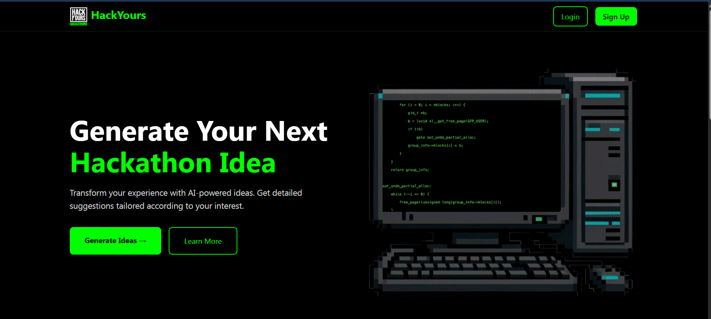
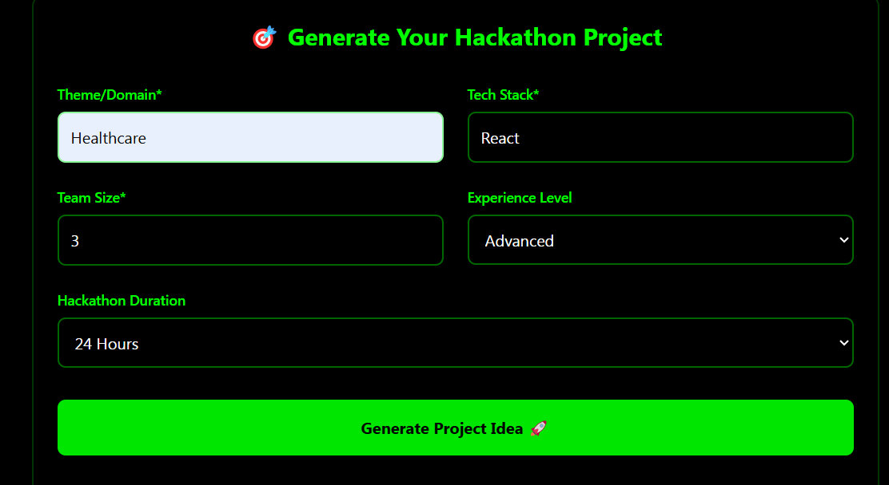

README.md
md
Copy
Edit
# 🚀 Binary Brains - AI-Powered Hackathon Companion

Hackstreet is a powerful AI-driven tool designed to help developers, students, and innovators instantly generate hackathon project ideas and structured implementation roadmaps using Google's Gemini API. Whether you're building solo or with a team, Hackstreet gives you a creative headstart.

---

## 🌟 Features

- 🎯 **AI-Generated Project Ideas** based on theme, tech stack, team size, and difficulty
- 🛣️ **Custom Roadmap Generator** with detailed development phases
- 🧠 Powered by **Google Gemini 1.5 Flash**
- 💡 User-friendly UI with futuristic vibes
- 🧩 Built with React, Tailwind CSS, and Vite

---

## 📸 Screenshots

> 



- `src/pages/IdeaGenerator.jsx`
- `src/pages/RoadmapGenerator.jsx`

---

## 🛠️ Tech Stack

| Frontend | Backend/API | Styling | AI |
|----------|-------------|---------|----|
| React    | Gemini API  | Tailwind CSS | Google Generative AI (gemini-1.5-flash) |

---

## 🚀 Getting Started

### 1. Clone the repo

```bash
git clone https://github.com/raghavxkatta/Hackstreet-2.git
cd Hackstreet-2
2. Install dependencies
bash
Copy
Edit
npm install
3. Set up your Gemini API Key
Create a .env file in the root directory:

env
Copy
Edit
VITE_GEMINI_API_KEY=your_api_key_here
You can get your API key from: https://makersuite.google.com/app/apikey

4. Run the development server
bash
Copy
Edit
npm run dev
🧠 How It Works
Enter your theme, tech stack, team size, and experience level.

Click Generate Project Idea — powered by Gemini API.

Once the idea is generated, click Generate Roadmap to get a 5-phase execution plan.

📁 Folder Structure
css
Copy
Edit
src/
├── components/
│   └── RoadmapGenerator.jsx
├── pages/
│   └── IdeaGenerator.jsx
├── App.jsx
├── main.jsx

🧑‍💻 Contributors
@raghavxkatta
@JustPratiyush
@rainyyyyshrrr12

📜 License
This project is open-source and available under the MIT License.

🙌 Acknowledgements
Google Gemini API

React + Vite + Tailwind

Built during Hackstreet Hackathon 💻🔥
